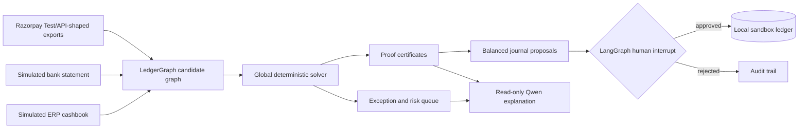

# Hackathon Submission — Finance Controller

## Track

**Razorpay Buildathon · Track 04 — AI Finance Controller**

> Run one finance-operations loop across a 50+ record batch, report measured
> accuracy, and expose every exception that could not be resolved.

## One-sentence pitch

Finance Controller reconciles Razorpay-shaped settlement exports, bank
movements, and merchant ERP evidence as one global money graph; deterministic
code owns every financial decision while a local Qwen model explains the
evidence and LangGraph enforces the human approval boundary.

## The problem

Settlement reconciliation is not a row lookup. One bank credit may contain
payments, refunds, fees, tax, disputes, and adjustments. References can be
missing or mutated, dates cross working-day boundaries, and locally plausible
matches can conflict elsewhere in the batch. A bank-level amount can balance
while an underlying component remains unsupported.

Finance teams therefore need more than a chatbot or a similarity score. They
need an engine that can:

1. explain the entire batch consistently;
2. prove exact signed-money conservation;
3. refuse unsupported component closure;
4. quantify its accuracy and residual exposure; and
5. prevent the AI layer from gaining accounting authority.

## What we built



### LedgerGraph

LedgerGraph generates bounded fuzzy candidates, then selects a globally
consistent explanation under hard accounting constraints:

- exact signed-money conservation;
- every bank and settlement node used at most once;
- 1:1, 1:N, N:1, and irreducible N:M group support;
- tied optima, insufficient evidence, and branch exhaustion abstain;
- selected groups emit proof certificates with rejected alternatives.

Fuzzy reference/date evidence can propose or rank candidates. It can never
override the money equation.

### Deterministic component verification

After matching a settlement, the controller independently recomputes its
payments, refunds, fees, tax, disputes, and adjustments. A bank match does not
imply component closure. Unsupported money remains an exception and blocks the
journal proposal.

### GraphShield

GraphShield is a secondary, non-authoritative relational review layer. It can
surface unfamiliar counterparty, approval, reference, or repeated-economic
paths. It cannot change a match, threshold, amount, proposal, or posting state.

### Local Qwen + LangGraph

- **Qwen 3.5 4B Q4_K_M:** read-only tool routing and evidence explanation on a
  4 GB RTX 3050-class GPU.
- **LangGraph:** resumable sequencing, persisted state, failure routing, and a
  human approval interrupt.
- **Deterministic Python:** all money arithmetic, graph selection, verification,
  journal construction, risk rules, and evaluation.

## Flagship batch

All committed financial records are synthetic.

| Item | Count |
|---|---:|
| Orders | 2,232 |
| Settlement reconciliation rows | 2,338 |
| Settlement nodes | 75 |
| Bank entries | 87 |
| Credits / debits | 79 / 8 |
| Globally selected reconciliation groups | 50 |
| Candidate graph edges | 473 |
| Dubious entries planted | 9 |
| Component exceptions | 3 |
| Journal proposals | 47 |
| Automatically posted | 0 |

The selected topology mix is deliberately balanced for solver coverage: 13
1:1, 12 1:N, 12 N:1, and 13 N:M groups. It is **not** a production prevalence
estimate. The UI marks native mechanics, integration failures, stress cases,
and ERP control anomalies separately.

## Measured results

### Reconciliation

| Metric | Exact-reference baseline | Finance Controller |
|---|---:|---:|
| Bank recall on resolvable entries | 8.0% | 100.0% |
| Bank match precision | 100.0% | 100.0% |
| Component closure precision | 83.3% | 100.0% |
| Component-exception recall | 0.0% | 100.0% |
| False automatic closures | 1 | 0 |

### Adversarial LedgerGraph suite

| System | Exact cases | Hypothesis recall | Selection precision | False selections |
|---|---:|---:|---:|---:|
| Exact-reference baseline | 5/11 | 33.3% | 100.0% | 0 |
| Row-wise L0/L1 | 6/11 | 55.6% | 83.3% | 1 |
| LedgerGraph global | 11/11 | 100.0% | 100.0% | 0 |

Four cases calibrate the selection threshold; seven are held out after the
threshold is frozen.

### Risk and open-world evaluation

| Evaluation | Current result | Correct interpretation |
|---|---:|---|
| Frozen 87-entry fixture | 100% recall | Closed-world conformance only. |
| Five-seed, 435-entry run | 100% recall | Generated robustness/regression evidence. |
| Exact controls on known mutation replay | 84.4% recall | Preserved baseline with ten relational misses. |
| GraphShield on the same known misses | 100% recall | Regression control; features were informed by those misses. |
| Hash-locked post-freeze fraud holdout | 0/35 recall, 100% specificity | Honest failure on new temporal, aggregate, vendor-master, and operating-hours families. |

The 0/35 result is intentionally published. It proves the evaluation can
expose missing capabilities rather than manufacture a flattering validation
claim. This project does not claim production fraud performance.

## Why AI is meaningful here

The AI is not used to hide accounting logic. It solves the human interface
problem around a deterministic controller:

- converts natural-language questions into allowlisted, typed read-only calls;
- explains proof certificates, exceptions, and evaluation artifacts;
- keeps citations and evidence objects attached to its answer;
- runs locally so simulated finance evidence does not leave the laptop.

The novel intelligence is the combination of global graph reconciliation,
verifiable accounting constraints, bounded relational review signals, and an
agentic workflow whose authority is deliberately narrower than its language
interface.

## Safety and authority boundary

- `Decimal` is used for money; no floating-point accounting.
- Live Razorpay keys are rejected.
- Razorpay integration is Test Mode, allowlisted, and read-only.
- No real bank or ERP connection exists.
- Qwen cannot calculate or change financial fields.
- Journal proposals are immutable and balanced before review.
- Posting requires a human LangGraph interrupt.
- The only posting target is a local idempotent SQLite sandbox ledger.
- Every exception includes source-row citations and extraction timestamps.
- Retries cannot double-post the same proposal ID.

See [`DATA_POLICY.md`](DATA_POLICY.md) for the publication and simulation policy.

## Three-minute judge path

1. **Judge Overview:** explain the three sources and authority boundary.
2. **Run Current Batch:** show measured throughput and no automatic posting.
3. **LedgerGraph:** switch from the 473-edge candidate mesh to the 50-group
   solution; open an N:M certificate and a rejected alternative.
4. **Risk Review:** open a dubious credit/debit and show timestamps, observed
   text, independent expected evidence, realism badge, and citations.
5. **Evaluation Proof:** contrast the known-miss 100% replay with the honest
   0/35 post-freeze holdout.
6. **Settlement Q&A:** ask why one entry was held; show that Qwen only explains
   the retrieved evidence.
7. **Approval Queue:** demonstrate that only a human can resume the local
   sandbox-posting interrupt.

The detailed script is in [`JUDGE_GUIDE.md`](JUDGE_GUIDE.md).

## Reproduce locally

For the complete GPU dashboard, follow [`LOCAL_SETUP.md`](LOCAL_SETUP.md).

For the deterministic evidence pipeline only:

```powershell
conda activate base
python -m pip install -r requirements.txt
python run.py
python -m eval.suite
python -m unittest discover -v
```

The model is not required to reproduce reconciliation or evaluation results.

## Known limitations

- All labels and money are synthetic.
- The balanced topology mixture is adversarial coverage, not observed merchant
  frequency.
- The working-day simulator uses a simplified Monday-Friday calendar rather
  than the full Indian bank-holiday calendar.
- The post-freeze holdout exposes missing temporal and aggregate GraphShield
  signals.
- No real bank, ERP, tax, or accounting-system connector is included.
- The local ledger is a safety demonstration, not a production accounting
  integration.
- The Qwen routing evaluation is narrow and does not establish unrestricted
  language-model reliability.

These limitations are visible in the product and are not hidden behind the
headline metrics.
