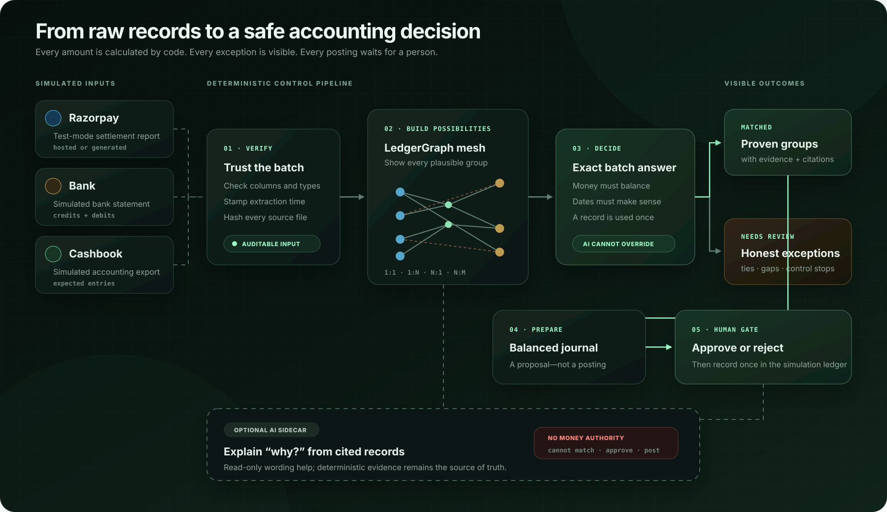

# Finance Controller

Finance Controller reconciles Razorpay settlements against bank and cashbook
records, explains every exception, prepares balanced journals, and waits for a
person before recording anything.

The repository ships with a complete simulated business dataset. It never needs
real financial data and cannot move real money.

## How it works



The core workflow is deterministic: code verifies the inputs, builds possible
reconciliation groups, and chooses one conflict-free batch answer. The optional
AI assistant can explain cited evidence in plain language, but it cannot match,
approve, or post money. The product exposes both the messy candidate Match Graph
and the final Human Approval Gate after it is started locally.

## What a finance team gets

- One work queue for settlement matching, exceptions, and journal approvals.
- Exact support for 1:1, 1:N, N:1, and N:M reconciliation groups—including
  declared cross-source groups with up to 1,000 records per side.
- Business-day chronology checks, including T+1 and T+2 settlement windows.
- Clear reasons, timestamps, amounts, and source-row citations for every stop.
- Balanced, immutable journal proposals with an explicit human approval gate.
- A full activity trail and repeatable reliability tests.
- Optional AI explanations without giving a language model financial authority.

## Safety model

The important boundary is simple:

| Responsibility | Owner |
| --- | --- |
| Calculate totals and signs | Deterministic Python using `Decimal` |
| Generate and select match groups | Declared-group verification, bounded subset-sum, and exact CP-SAT proofs |
| Enforce one-use, chronology, and balancing rules | Deterministic code |
| Route questions and retrieve evidence | Allowlisted deterministic code |
| Rewrite checked evidence in plain language | Optional AI provider |
| Approve or reject a journal | Human reviewer |
| Record an approved entry | Idempotent simulation ledger |

If the candidate search is incomplete, the optimum is tied, a component cannot
be explained, or a control fails, the system stops for review. AI cannot change
a match, amount, score, approval, or ledger entry.

### Large reconciliation groups

Large groups use two different safety policies:

- A dedicated `reconciliation_group_id`, `payout_id`, or `batch_id` appearing
  on both sources can identify up to **1,000 bank records and 1,000 settlement
  records**. The controller verifies the declared membership, exact total, and
  chronology directly instead of enumerating subsets.
- When membership is unknown, CP-SAT may infer up to **100 members** from a
  pool of at most **1,000 strongly related records**. The optimum and its
  uniqueness must both be proven within the time budget.
- Small unlabelled groups continue through complete dynamic-programming
  candidate generation. Arbitrary or timed-out N:M searches stop for review.

These are computation and control limits, not claims that a 1,000×1,000
unstructured match is always identifiable. Large declared groups receive a
compact hashed candidate ID while retaining their complete member lists in the
audit artifact.

## Quick start: Windows, macOS, or Linux

### Requirements

- Git
- Python 3.10 or newer
- Node.js 22.13 or newer (Corepack is included with supported Node releases)

Conda `base`, `venv`, and system Python all work. A GPU is not required.

### 1. Clone and create an environment

```bash
git clone https://github.com/sycoraxx/ledgergraph-finance-controller.git
cd ledgergraph-finance-controller
python -m venv .venv
```

Activate it on macOS or Linux:

```bash
source .venv/bin/activate
```

Activate it on Windows PowerShell:

```powershell
.\.venv\Scripts\Activate.ps1
```

If you prefer Conda, replace the two `venv` commands with `conda activate base`.

### 2. Install everything

```bash
python scripts/setup.py
```

This installs the pinned Python and frontend dependencies. It does not download
a multi-gigabyte model.

### 3. Start the product

```bash
python scripts/start.py
```

Open <http://localhost:3000>. The API health endpoint is
<http://127.0.0.1:8000/api/health>. Press `Ctrl+C` once to stop both services.

The first screen uses the committed simulated result snapshot. Select **Run
current batch** to execute the reconciliation workflow again.

## Docker quick start

Docker Desktop or Docker Engine provides the same path on all three platforms:

```bash
docker compose up --build
```

Open <http://localhost:3000>. Generated results are persisted in the local
`results/` directory. Stop the stack with `Ctrl+C`, then run:

```bash
docker compose down
```

## Configuration

No configuration is required for the simulated workflow. To change optional
features, copy the example file:

macOS or Linux:

```bash
cp .env.example .env
```

Windows PowerShell:

```powershell
Copy-Item .env.example .env
```

The project loads `.env` without overriding variables supplied by a deployment
platform.

| Variable | Default | Purpose |
| --- | --- | --- |
| `FINCTRL_MODEL_PROVIDER` | `none` | `none`, `local`, `groq`, `gemini`, or `openai_compatible` |
| `FINCTRL_MODEL_URL` | provider default | OpenAI-compatible base URL |
| `FINCTRL_MODEL` | provider default | Model identifier |
| `FINCTRL_MODEL_API_KEY` | empty | Generic hosted-provider secret |
| `GROQ_API_KEY` | empty | Groq secret |
| `GEMINI_API_KEY` | empty | Gemini secret |
| `FINCTRL_MODEL_TIMEOUT` | `90` | Explanation request timeout in seconds |
| `FINCTRL_ALLOWED_ORIGINS` | local web URLs | Comma-separated browser origins allowed by the API |
| `RAZORPAY_KEY_ID` | empty | Optional `rzp_test_...` key only |
| `RAZORPAY_KEY_SECRET` | empty | Optional Razorpay Test Mode secret |
| `NEXT_PUBLIC_API_URL` | `http://127.0.0.1:8000` | Browser-visible API URL; set in the web build environment |
| `NEXT_PUBLIC_SITE_URL` | `http://localhost:3000` | Public web origin used for social-preview metadata |

Never commit `.env`. The repository ignores it, the API never returns provider
keys, and the Razorpay connector rejects live credentials.

## Optional AI explanations

The product works fully with `FINCTRL_MODEL_PROVIDER=none`; deterministic text
is returned when no model is configured. A model improves wording only.

### Hosted provider

For Groq:

```dotenv
FINCTRL_MODEL_PROVIDER=groq
GROQ_API_KEY=your_key
```

For Gemini:

```dotenv
FINCTRL_MODEL_PROVIDER=gemini
GEMINI_API_KEY=your_key
```

For any OpenAI-compatible endpoint:

```dotenv
FINCTRL_MODEL_PROVIDER=openai_compatible
FINCTRL_MODEL_URL=https://provider.example/v1
FINCTRL_MODEL=provider-model-id
FINCTRL_MODEL_API_KEY=your_key
```

Provider quotas and prices change; check the provider's current terms before a
deployment. Prompts contain the selected simulated evidence, so a business must
complete its own provider and data-processing review before using real records.

### Local Qwen on Windows + NVIDIA GPU

The pinned convenience bundle currently targets Windows CUDA:

```powershell
python scripts/setup.py --with-local-model
.\start-dashboard.ps1
```

The GGUF weights and llama.cpp runtime stay inside `models/` and `runtime/` and
are checksum-verified. macOS and Linux users can point `local` mode at their own
OpenAI-compatible llama.cpp service.

## Using the product

1. **Home** — confirm the extraction window, batch size, items needing review,
   and journals waiting for a decision.
2. **Match** — inspect the complete candidate mesh or the accepted solution;
   click a node or link for its evidence.
3. **Review** — investigate stopped credit and debit entries using observed text,
   expected text, timestamps, and exact source rows.
4. **Approve** — open a balanced journal, review its evidence, then approve or
   reject it. Approval records only to the simulation ledger.
5. **History** — see pipeline and reviewer actions in time order.
6. **Controls** — inspect test results, known blind spots, and data provenance.

The operating procedure, role split, and incident handling are in
[BUSINESS_OPERATIONS.md](BUSINESS_OPERATIONS.md).

## Data and integrations

The default inputs are synthetic CSV/JSON files in `data/`, generated from
official schema shapes plus explicitly labelled accounting stress cases. See
[DATA_POLICY.md](DATA_POLICY.md).

An optional Razorpay Test Mode connector can read simulated hosted API activity.
It does not supply a bank statement or merchant cashbook; those remain synthetic
because Razorpay does not own those systems. Live keys and money-moving endpoints
are out of scope.

## Verification and development

Run the backend safety tests:

```bash
python -m unittest discover -v
```

Rebuild the data and current batch results:

```bash
python run.py
```

Run the independent evaluation suites:

```bash
python -m eval.suite
```

Check the frontend:

```bash
cd web
corepack pnpm run lint
corepack pnpm run build
```

Or run setup and all fast checks together:

```bash
python scripts/setup.py --check
```

## Repository map

| Path | Purpose |
| --- | --- |
| `agent/` | Reconciliation, risk checks, journals, Q&A, and LangGraph workflow |
| `dashboard/` | FastAPI product API |
| `web/` | React/Vinext user interface |
| `generator/` | Seeded synthetic business-data generator |
| `eval/` | Baselines, robustness, regression, and held-out tests |
| `integrations/` | Razorpay Test Mode read-only connector |
| `data/` | Synthetic source records and labels |
| `results/` | Reproducible outputs, metrics, and simulation ledger |
| `scripts/` | Cross-platform setup/start and optional local-model utilities |

`python scripts/export_demo_snapshot.py` refreshes the secret-free, read-only
sample used when the web app is hosted without an API.

For implementation details, see [TECHNICAL_REFERENCE.md](TECHNICAL_REFERENCE.md).
For a concise narrated walkthrough, see
[FIVE_MINUTE_DEMO.md](FIVE_MINUTE_DEMO.md).

## Deploying for a business pilot

Deploy the API and web app as separate services or use the supplied containers.
Use one API worker because the current approval state is SQLite-backed, mount a
persistent `results/` volume, set the public web origin in
`FINCTRL_ALLOWED_ORIGINS`, and keep all secrets in the platform's secret store.
See [DEPLOYMENT.md](DEPLOYMENT.md) for the full checklist.

This repository is ready for a controlled simulation or internal evaluation. It
is **not yet production accounting software**. Before real financial records or
multiple users are introduced, add authentication and role-based access,
tenant isolation, a managed transactional database, encrypted object storage,
backup/restore, monitoring, retention controls, connector certification, and an
independent security and accounting review.

## Troubleshooting

- **`pnpm` is not recognized:** run commands through `corepack pnpm`, or rerun
  `python scripts/setup.py` after installing Node.js 22.13+.
- **PowerShell blocks activation:** use `conda activate base`, or allow the
  current process with `Set-ExecutionPolicy -Scope Process Bypass`.
- **Port 3000 or 8000 is busy:** run
  `python scripts/start.py --web-port 3001 --api-port 8001`.
- **The assistant says built-in mode:** this is safe and expected when no hosted
  key or local model is configured.
- **The dashboard shows saved results:** the frontend is available but the API
  is not; confirm <http://127.0.0.1:8000/api/health>.
- **Docker web cannot reach a hosted API:** rebuild with the browser-visible API
  URL described in [DEPLOYMENT.md](DEPLOYMENT.md).

## Commercial use and license

No open-source license has been declared in this repository. Source availability
does not grant commercial-use rights; add an organization-approved license before
distribution or production adoption.
